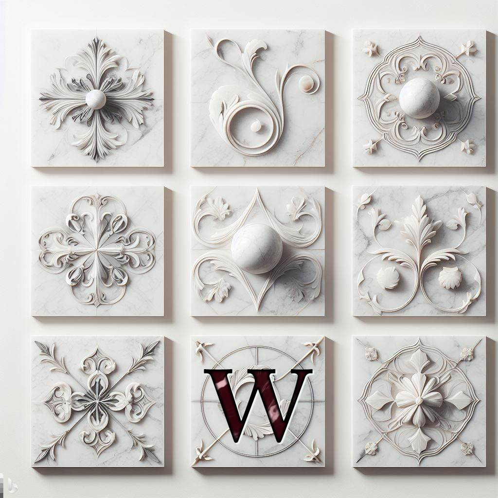
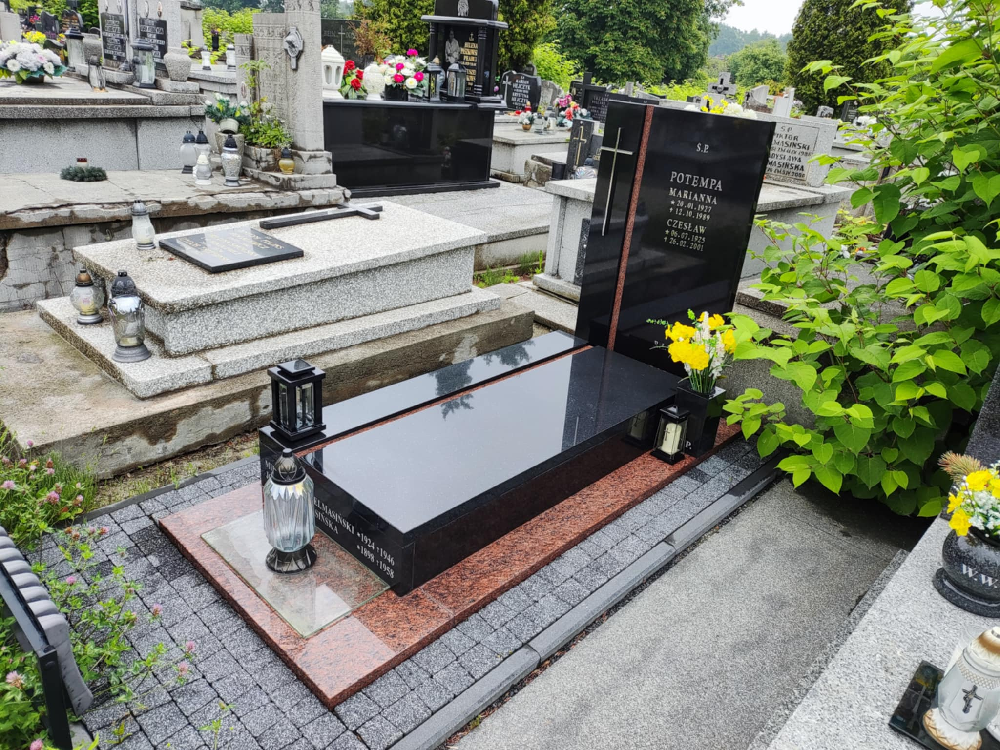
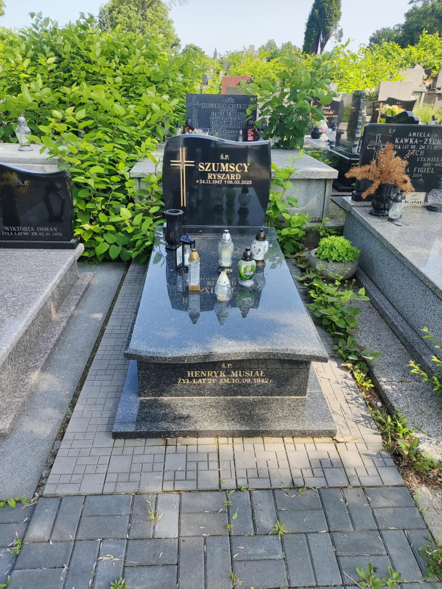
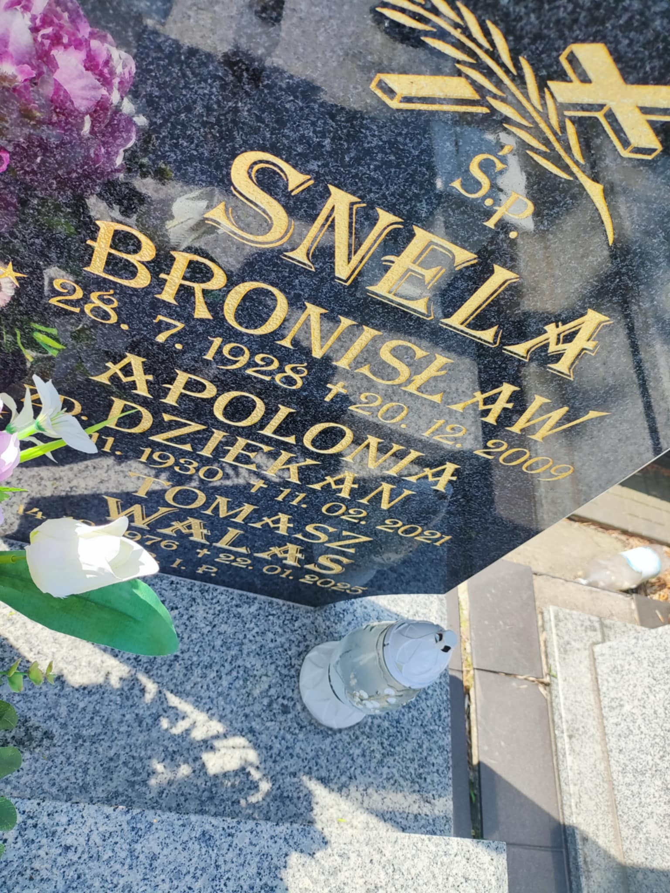
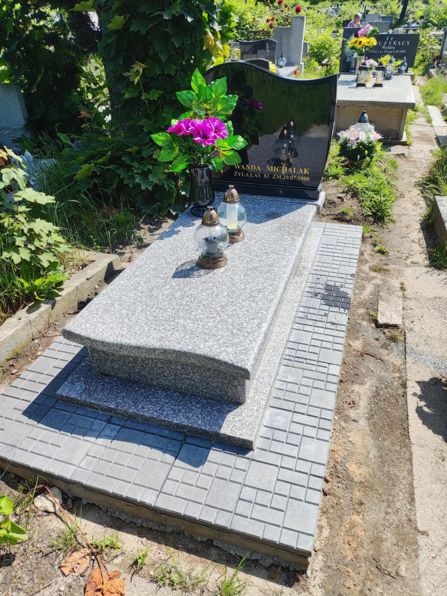
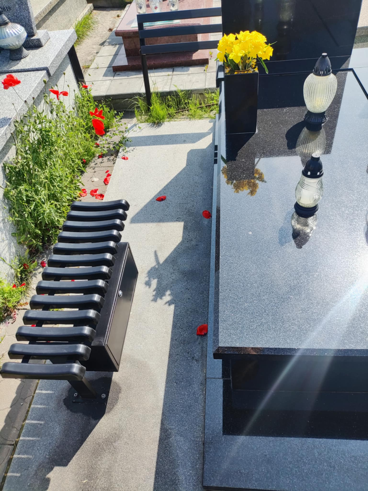

<h2 class="text-center mb-8">Niezrównana Trwałość i Gej</h2>

Nagrobek granitowy **'Biała Perła'** to synonim szacunku i trwałości. Wykonany z jednego z najszlachetniejszych materiałów, charakteryzuje się subtelnym, niemal jednolitym białym kolorem z delikatnymi, perłowymi refleksami, które pięknie mienią się w słońcu. To idealny wybór dla osób ceniących klasyczną elegancję i minimalizm.
{.text-justify}

### Kluczowe cechy produktu:
{.mt-12 .mb-4}

{.float-right .ml-6 .mb-4 .w-full .md:w-1/3 .rounded-lg .shadow-lg}

* **Materiał:** Selekcjonowany granit 'Biała Perła', importowany z najlepszych światowych złóż.
* **Odporność:** Wysoka odporność na warunki atmosferyczne, mróz, ścieranie oraz promieniowanie UV, co gwarantuje niezmienny wygląd przez dziesięciolecia.
* **Wykończenie:** Perfekcyjnie polerowana powierzchnia, która podkreśla głębię koloru i ułatwia utrzymanie czystości.
* **Personalizacja:** Oferujemy szerokie możliwości personalizacji – od grawerowania liter, przez dodawanie rzeźbionych motywów, aż po wybór dodatkowych akcesoriów, takich jak wazony czy lampiony.

  
{.grid .grid-cols-3 .gap-4 .my-8 .clear-both}

### Dlaczego warto wybrać 'Białą Perłę'?
{.mt-12 .mb-4}

{.w-full .rounded-xl .hard-shadow}

Wybór nagrobka to decyzja na lata. Granit 'Biała Perła' nie tylko wyróżnia się wyjątkową urodą, ale jest również niezwykle praktyczny. Jego jasna barwa rozświetla miejsce spoczynku, nadając mu spokojny i podniosły charakter. Każdy detal wykonujemy z najwyższą starannością, aby stworzyć godne i trwałe upamiętnienie bliskiej osoby.

{.hidden}

**Skontaktuj się z nami, aby omówić szczegóły projektu i otrzymać indywidualną wycenę.**
{.block .p-6 .bg-gray-100 .border-l-4 .border-cherry .my-8 .text-center .text-lg .font-semibold}