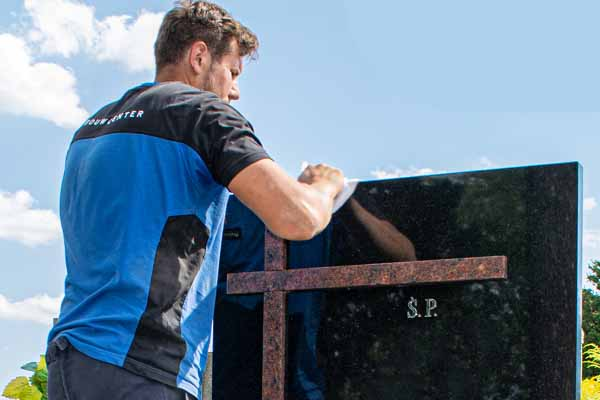
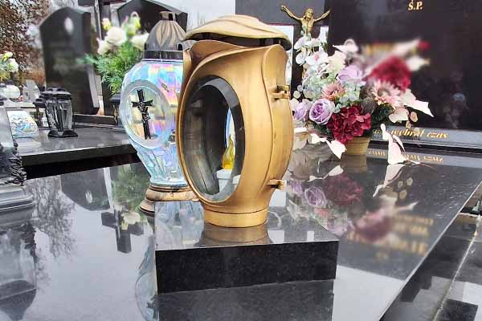
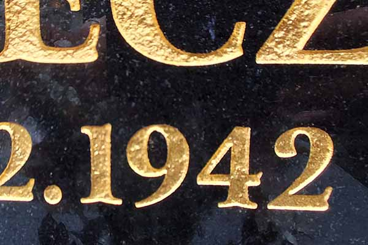

**Opieka nad miejscem spoczynku naszych bliskich to dla wielu z nas ważny, symboliczny obowiązek. Wybierając pomnik z granitu, decydujemy się na materiał niezwykle trwały, odporny na mróz i upływ czasu. Choć granit słynie ze swojej wytrzymałości, jego polerowana powierzchnia wymaga odpowiedniego traktowania. Niewłaściwe środki czyszczące mogą zmatowić kamień i pozbawić go naturalnego blasku. Jak zatem prawidłowo dbać o nagrobek z granitu, by wyglądał nienagannie przez pokolenia?**

## Czego unikać przy czyszczeniu pomnika z granitu? Złota zasada: mniej znaczy więcej

Największym wrogiem polerowanego granitu nie jest wcale pogoda, **ale... nadmiar chemii**. Wiele osób w dobrej wierze sięga po silne detergenty domowe, które wyrządzają kamieniowi więcej szkody niż pożytku. Tego należy bezwzględnie unikać przy czyszczeniu granitu:

- **mleczek do czyszczenia z mikrogranulkami oraz proszków do szorowania**: te produkty mają silne właściwości ścierne. Nawet jeśli na początku nie zauważysz uszkodzeń gołym okiem, politura zacznie stopniowo tracić swój lustrzany blask i stawać się matowa. Powstałe w ten sposób zmatowienia są nieodwracalne w domowych warunkach;
- **żrącej chemii gospodarczej, wybielaczy i środków na bazie chloru**: silne preparaty, przeznaczone np. do sanitariatów, wchodzą w gwałtowne reakcje chemiczne z minerałami zawartymi w strukturze granitu. Ich zastosowanie często kończy się powstaniem głębokich, jasnych odbarwień i nieestetycznych wykwitów. Usunięcie takich chemicznych „poparzeń" z kamienia jest niemożliwe bez interwencji zakładu kamieniarskiego, który musi zeszlifować zniszczoną warstwę;
- **ostrych szczotek, druciaków kuchennych i szorstkich stron gąbek**: mechaniczne szorowanie twardymi akcesoriami błyskawicznie rysuje wypolerowaną powierzchnię. W tak uszkodzoną, chropowatą strukturę kamienia znacznie szybciej i głębiej wnika brud oraz woda. Kiedy wilgoć nagromadzona w powstałych mikroszczelinach zamarznie zimą, będzie powoli osłabiać materiał od środka, przyspieszając jego erozję;
- **past, wosków i chemicznych nabłyszczaczy**: to jeden z najczęstszych błędów pielęgnacyjnych. Granit absolutnie nie wymaga woskowania, a jego głęboki połysk to wyłącznie zasługa odpowiedniej obróbki i polerowania maszynami. Nakładanie tłustych past daje złudny, chwilowy efekt. W rzeczywistości tworzą one na pomniku lepką powłokę, do której jak magnes przykleja się kurz, opadające liście oraz sadza ze zniczy. W krótkim czasie na płycie powstaje ciemna, trudna do zmycia skorupa.

Zamiast ryzykować zniszczenie płyty i kosztowną renowację, znacznie bezpieczniej jest postawić na sprawdzone, minimalistyczne metody pielęgnacji, które w zupełności wystarczą do utrzymania kamienia w idealnym stanie.

## Czy granit można myć płynem do naczyń?

Zdecydowanie tak! **Klasyczny płyn do naczyń to jeden z najbezpieczniejszych sposobów na pielęgnację nagrobków**. Tajemnica jego skuteczności tkwi w łagodnej formule. Standardowe płyny mają pH zbliżone do neutralnego, co oznacza, że są przyjazne dla polerowanych powierzchni. W przeciwieństwie do agresywnej chemii gospodarczej**, nie powodują one mikrouszkodzeń, matowienia ani odbarwień**, dzięki czemu naturalny blask granitu pozostaje nienaruszony przez długie lata.

Warto jednak pamiętać o odpowiednich proporcjach. **Wystarczy dodać zaledwie kilka kropel delikatnego płynu do wiadra z ciepłą wodą, aby stworzyć skuteczny roztwór myjący**. Zbyt duża ilość detergentu to bardzo częsty błąd - powstaje wtedy obfita piana, którą trudno spłukać, a na powierzchni kamienia pozostaje cienki, lepki film. **Taka niewidoczna powłoka przyciąga kurz, pył i opadające liście**, przez co pomnik brudzi się znacznie szybciej.

Mimo swojej delikatności dla kamienia, roztwór wody z płynem do naczyń ma doskonałe właściwości odtłuszczające. Bez najmniejszego problemu radzi sobie z uporczywymi, organicznymi zabrudzeniami, takimi jak ptasie odchody czy lepkie soki i pyłki z drzew. **Znakomicie usuwa również tłusty, ciemny osad ze smogu i spalin**, który osiada na płytach zwłaszcza w okresie jesienno-zimowym. Lekko odtłuszczające działanie płynu ułatwi również doczyszczenie miejsc, z których wcześniej zdrapaliśmy rozlany wosk ze zniczy.

<figcaption>Dobrej jakości granit będzie zachowywał naturalny połysk przy regularnej pielęgnacji.</figcaption>

## Czy granit można czyścić płynem do szyb lub wodą z octem?

Zdecydowanie odradzamy oba te rozwiązania. Chociaż użycie płynu do szyb kusi wygodą i obietnicą błyskawicznego odświeżenia nagrobka, w rzeczywistości jest dla kamienia bardzo ryzykowne. **Większość drogeryjnych preparatów do okien opiera swój skład na agresywnym amoniaku, alkoholu oraz sztucznych barwnikach**. Ich częste aplikowanie na granit prowadzi do stopniowego degradowania i matowienia polerowanej powierzchni. Problem ten jest szczególnie uciążliwy w przypadku **nagrobków z ciemnego kamienia**, gdzie po użyciu takiego płynu często pozostają bardzo trudne do usunięcia, nieestetyczne smugi, psujące cały efekt wizualny.

Równie szkodliwym, choć niestety wciąż popularnym mitem, jest **mycie pomnika wodą z dodatkiem octu**. Tego domowego sposobu należy bezwzględnie unikać przy pielęgnacji cmentarnej. **Granit, podobnie jak inne szlachetne kamienie naturalne, wykazuje ogromną wrażliwość na działanie substancji o odczynie kwasowym**. Zastosowanie roztworu na bazie octu, a nawet powszechnie używanego kwasku cytrynowego, inicjuje reakcję chemiczną, która powoduje powolne, ale trwałe niszczenie zewnętrznej, wypolerowanej struktury kamienia.

Konsekwencje stosowania kwasów i amoniaku są dla nagrobka bardzo niekorzystne. **Wytrawiony granit staje się szorstki i porowaty, przez co znacznie szybciej chłonie wilgoć i brud, co w obliczu ostrych, przymrozków może przyspieszać niszczenie materiału**. Warto mieć świadomość, że uszkodzonej w ten sposób politury nie naprawimy domowymi sposobami - przywrócenie płycie jej pierwotnego, lustrzanego blasku będzie wymagało specjalistycznej interwencji i ponownego, mechanicznego polerowania przez zakład kamieniarski.

## Czym umyć pomnik z granitu?

Najlepszym i najbezpieczniejszym rozwiązaniem do mycia granitowych nagrobków **jest ciepła woda i odrobina delikatnego płynu do naczyń**. Zanim jednak przystąpisz do mycia na mokro, pamiętaj o absolutnie kluczowym, choć często pomijanym kroku**. Zawsze zaczynaj od dokładnego zmiecenia z płyty piasku, drobnych kamyczków, zaschniętych liści i kurzu za pomocą zmiotki o miękkim włosiu**. Zignorowanie tego etapu to najprostsza droga do zniszczenia nagrobka. Bezpośrednie przecieranie gąbką brudnej powierzchni sprawia, że drobiny piasku zachowują się podobnie jak papier ścierny i tworzą na polerowanej politurze nieodwracalne, matowe mikrorysy.

Aby mycie było bezpieczne dla kamienia i dało idealny efekt, warto przeprowadzić je w 3 prostych krokach:

- **Umyj płytę miękką gąbką lub ściereczką z mikrofibry nasączoną roztworem ciepłej wody z płynem do naczyń**. Ciepła woda znacznie szybciej i skuteczniej rozpuszcza zaschnięte błoto, pyłki czy soki z drzew, nie naruszając przy tym struktury materiału. Pamiętaj, aby często płukać ściereczkę, by nie wcierać zebranego brudu z powrotem w kamień.
- **Po wyczyszczeniu całej powierzchni spłucz pomnik dużą ilością czystej wody**. Ten zabieg jest niezbędny, aby usunąć z płyty wszelkie resztki brudu oraz detergentu, które w przeciwnym razie mogłyby stworzyć na kamieniu lepką warstwę.
- **Ostatnim etapem, który gwarantuje nienaganny efekt wizualny, jest odpowiednie osuszenie pomnika**. Zamiast pozwalać wodzie samoistnie odparować, wytrzyj płytę do sucha, używając do tego czystej ściereczki z mikrofibry lub naturalnej irchy.

Woda z cmentarnych ujęć **często jest twarda i mocno zmineralizowana**. Pozostawienie jej na nagrobku sprawi, że po wyschnięciu powstaną nieestetyczne, jasne zacieki z osadu wapiennego, które są szczególnie widoczne i trudne do usunięcia na ciemnych odmianach granitu.

<figcaption>Granitowa misa lub podwyższenie przeznaczone na znicze może zaoszczędzić wiele bólu głowy i ochronić nagrobek przed plamami.</figcaption>

## Jak bezpiecznie usunąć rozlany wosk z pomnika?

Plamy z wosku i parafiny po wylanych zniczach to największa zmora na cmentarzach. Jeśli chcesz się ich szybko pozbyć z nagrobka, pod żadnym pozorem nie zeskrobuj wosku nożem, śrubokrętem czy metalową szpachelką! Zamiast tego użyj **drewnianej lub plastikowej szpatułki**. Świetnie sprawdzi się też skrobaczka do szyb samochodowych lub drewniana łyżka kuchenna.

Jeśli wosk mocno trzyma się płyty, **możesz polać go gorącą wodą**. Ciepło zmiękczy parafinę i pozwoli na jej łatwe i bezpieczne zsunięcie z kamienia za pomocą drewnianej szpatułki. Pozostałości możesz przemyć gąbką z ciepłą wodą i płynem do naczyń. W przypadku bardzo głębokich, starych plam z wosku, które wniknęły w strukturę jasnego granitu, warto zaopatrzyć się w specjalistyczny płyn do usuwania wosku z kamienia naturalnego.

<figcaption>Pielęgnacja liter to delikatny proces, który nie lubi drucianej szczotki.</figcaption>

## Jak czyścić litery na pomniku? Pamiętaj o ostrożności

Podczas sezonowego mycia pomnika należy również zwrócić uwagę **na stan liter**. Pamiętaj, aby nie szorować mocno wgłębień z napisami. Zbyt mocny nacisk, użycie twardej szczotki czy szorstkiej gąbki sprawi, że szybko zetrzesz warstwę kryjącą.

Jest to niezwykle ważne, zwłaszcza jeśli na inskrypcje nakładane były **płatki metali szlachetnych**, **np**. **klasyczne złoto**, **platyna lub srebro**. O ile zdartą w ten sposób zwykłą farbę można jeszcze stosunkowo łatwo odnowić, o tyle zdrapanie drogocennych płatków to nieodwracalna, kosztowna strata.

Bez względu na rodzaj wypełnienia - czy to standardowa farbka, czy szlachetne złocenie - szorowanie rzazów jest zawsze błędem. Do czyszczenia okolic liter najlepiej używać wyłącznie miękkiej ściereczki, delikatnie przecierając płaską powierzchnię kamienia i starając się omijać same rzazy.

Nawet przy najbardziej ostrożnej pielęgnacji, upływający czas, mróz i słońce robią swoje. Jeżeli podczas porządków zauważysz, że nagrobek wymaga już fachowej ręki, litery wyblakły i stają się nieczytelne, skontaktuj się z nami. Jako doświadczona pracownia kamieniarska z Dąbrowy Górniczej zajmujemy się nie tylko tworzeniem nowych pomników od podstaw. **Świadczymy również usługi z zakresu profesjonalnej opieki nad nagrobkami na terenie województwa śląskiego**. Z chęcią zajmiemy się renowacją, ponownym złoceniem liter, bezpiecznym wypoziomowaniem konstrukcji czy ułożeniem trwałej galanterii wokół grobu, przywracając miejscu spoczynku Twoich bliskich dawny, godny wygląd.