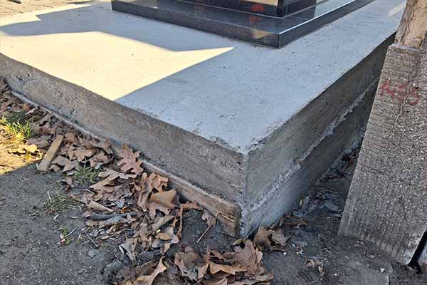
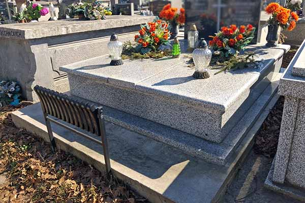
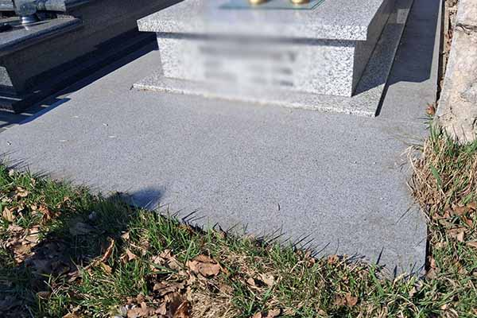

**Widok przechylającego się nagrobka to przykre doświadczenie i dość częsty problem na wielu polskich cmentarzach. Taka sytuacja stanowi bezpośrednie ostrzeżenie o pracującym gruncie lub wcześniejszych błędach montażowych.** **Wyjaśniamy, dlaczego masywne kamienie tak łatwo osiadają w ziemi pod wpływem własnego ciężaru, i w jaki sposób rzetelnie wylany, zbrojony fundament uchroni pomnik przed pęknięciami.**

**Co zrobić, gdy stary pomnik zaczyna się zapadać?**

Jeśli zbliża się ceremonia pogrzebu, a stary pomnik Twoich bliskich zaczyna się zapadać i grozi zawaleniem, **nie naprawiaj go samodzielnie**. Podpieranie deskami, dosypywanie ziemi czy używanie domowych zapraw cementowych tylko pogorszy sytuację i utrudni późniejszą naprawę.

W takiej sytuacji jedynym właściwym wyjściem będzie **pilny kontakt z naszym zakładem kamieniarskim**. Aby umożliwić godny pochówek, najpierw zabezpieczamy teren i przeprowadzamy pełny demontaż zniszczonej konstrukcji jeszcze przed ceremonią. Usunięcie przechylonych płyt i starego fundamentu sprawia, że miejsce pochówku wygląda schludnie i jest w pełni bezpieczne podczas pożegnania zmarłego.

Dopiero po pogrzebie przechodzimy do **właściwego etapu ratowania nagrobka**. Cały proces polega na dokładnym oczyszczeniu zdemontowanych elementów z dawnych spoin, wylaniu całkowicie nowej i wzmocnionej podstawy betonowej oraz ponownym złożeniu całości na stabilnym podłożu, zgodnie z aktualnymi zasadami sztuki kamieniarskiej.

## Osiadanie ziemi. Po jakim czasie od pochówku można stawiać pomnik?

Po pożegnaniu bliskiej osoby naturalnie pojawia się w nas potrzeba, aby jak najszybciej postawić piękny pomnik i symbolicznie zamknąć ten trudny czas. Jednak w rzemiośle kamieniarskim **zawsze musimy ustąpić przed prawami natury**. Prace ziemne na cmentarzu głęboko naruszają zbitą przez dziesięciolecia glebę, pozostawiając w jej wnętrzu **mnóstwo pustych przestrzeni i spulchnionego materiału**. Naruszona ziemia potrzebuje wielu miesięcy na ułożenie się pod wpływem własnego ciężaru, jesiennych deszczy czy powoli topniejącego, zimowego śniegu. Ignorowanie naturalnego osiadania gruntu to najkrótsza droga do niepotrzebnych nerwów i poważnych problemów z nowym pomnikiem.

Z montażem nagrobka należy odczekać **od 3 miesięcy do nawet roku**, **jednak zasada ta dotyczy wyłącznie nowo powstałych grobów.** Tyle czasu zwykle potrzebuje naruszony grunt, aby naturalnie osiąść i odpowiednio się ustabilizować. W przypadku pochówków w istniejących już grobowcach prace montażowe można rozpocząć znacznie wcześniej

Przestrzeganie tej reguły przy nowych piwniczkach jest istotne, zwłaszcza w przypadku **klasycznych nagrobków granitowych, których masa nierzadko przekracza tonę**. Zbyt wczesny montaż na wciąż pracującym podłożu może prowadzić do nierównomiernego osiadania konstrukcji. W konsekwencji poszczególne elementy nagrobka zaczynają się rozchodzić i powstają szczeliny. Gdy do wnętrza przedostanie się woda, **zimowe cykle zamarzania i odmarzania stopniowo osłabiają spoiny, znacząco zwiększając ryzyko uszkodzeń**, a z czasem nawet pękania kamienia.

Rzetelny montaż wymaga w tym wypadku **oparcia całej ramy nagrobkowej bezpośrednio na tak zwanej caliźnie**. Pod tym branżowym pojęciem kryje się po prostu nienaruszona, twarda ziemia leżąca tuż za krawędziami dawnego wykopu, dająca jedyne pewne podparcie dla potężnej konstrukcji pomnika. Po przeniesienie głównego nacisku poza miękki, wciąż pracujący środek mogiły **ciężki granit zyskuje stabilną bazę i przestaje reagować na ruchy spulchnionego gruntu**. Wówczas gotowy pomnik zniesie najtrudniejsze warunki pogodowe bez ryzyka pęknięć czy niebezpiecznych przechyłów.

<figcaption>W Kamieniarstwie Wiśniewski dobra wylewka to podstawa!</figcaption>

## Betonowy, zbrojony fundament to najważniejszy element nagrobka

Podczas wyboru nagrobka koncentrujesz się przede wszystkim na estetycznych walorach skały lub kunsztownie wykonanych detalach. Takie podejście jest w pełni uzasadnione, ponieważ pomnik ma być przede wszystkim godną wizytówką pamięci o kimś bliskim. Trzeba jednak pamiętać, **że o długowieczności całej instalacji decyduje element schowany głęboko w gruncie**. Wylewka betonowa pełni funkcję platformy nośnej, która musi udźwignąć kilkusetkilogramowy lub nawet kilkutonowy nagrobek.

Właściwe wykonany fundament pomnika powinien spełniać kilka bardzo ważnych parametrów technicznych:

- **klasa betonu i właściwy przekrój ramy**: klasa betonu powinna wynosić co najmniej **B25**, a grubość wylewki od **10 do 15 centymetrów**. Słabsze mieszanki typu B10 lub próba nadmiernego odchudzania samej ramy nośnej sprawia, że podstawa błyskawicznie traci swoją strukturę pod wpływem wilgoci oraz gwałtownych skoków temperatury. Certyfikowany beton o niskiej nasiąkliwości zapewnia solidne oparcie, więc nagrobek nie zacznie osiadać ani pękać pod wpływem własnego, ciężaru;
- **wzmocnienie wylewki za pomocą stalowego zbrojenia**: najlepiej sprawdzają się pręty żebrowane o średnicy **8 lub 10 milimetrów**. Sam beton świetnie radzi sobie z naciskiem z góry, lecz bez stalowego szkieletu jest podatny na pękanie pod wpływem sił rozciągających działających wewnątrz ziemi. Umieszczenie kratownicy wewnątrz wylewki spina całą strukturę w jedną całość i skutecznie chroni pomnik w trakcie zimowych mrozów, kiedy zamarzająca woda napiera na fundament od spodu;
- **dokładna geometria i płaska powierzchnia bazowa**: każdy milimetr odchylenia na poziomie gruntu jest widocznym błędem w trakcie montażu płyt granitowych i zazwyczaj skutkuje powstawaniem brzydkich szpar na łączeniach. Idealnie gładka baza pozwala na równomierne rozłożenie nacisku wszystkich elementów, a to z kolei chroni twardy kamień przed powstawaniem niszczących naprężeń.

W Kamieniarstwie Wiśniewski **uczciwie podchodzimy do prac betoniarskich**. Stawiamy na wysoką jakość materiałów konstrukcyjnych, więc zyskujesz pewność, że wybrany nagrobek zachowa swój nienaganny stan przez wiele pokoleń.

<figcaption>Remontowane pomniki to nie tylko granit, ale zadbanie o prawidłowy fundament.</figcaption>

**Jak wygląda naprawa i ponowny montaż zapadającego się pomnika?**

Naprawa przechylonego nagrobka wykracza daleko poza doraźne podparcie i wyrównanie płyt. **Aby problem zapadania się nigdy nie powrócił, musimy znaleźć przyczynę, rozebrać konstrukcję i zbudować nową, solidną podstawę**. Cały proces wymaga precyzyjnego planowania oraz wykorzystania specjalistycznych materiałów budowlanych, które oprą się zmiennym warunkom atmosferycznym.

**1\. Demontaż starego nagrobka**

W przypadku naprawy zapadającego się pomnika, prace zaczynamy od jego ostrożnego demontażu. **Rozbieramy nagrobek element po elemencie, uważając, by nie uszkodzić płyt**, **jeśli są jeszcze w dobrym stanie**, a następnie dokładnie oczyszczamy kamień z dawnych spoin. Rozkuwamy i usuwamy również stary, uszkodzony fundament.

**2\. Ocena gruntu i przygotowanie terenu**

Na tak przygotowanym stanowisku przechodzimy do oceny gruntu. Zaczynamy od sprawdzenia **gęstości oraz wilgotności podłoża**. W ten sposób upewniamy się, czy naruszona ziemia już wystarczająco się uleżała i nie stwarza ryzyka zapadania się pomnika w przyszłości. Usuwamy wszelkie pozostałości po poprzednich konstrukcjach oraz korzenie roślin**.** Jest to konieczne, ponieważ nawet najmniejsze zanieczyszczenia organiczne ukryte bezpośrednio pod fundamentem mogą w przyszłości prowadzić do osiadania całego nagrobka.

**3\. Osadzenie zbrojonego fundamentu**

Wykorzystujemy **certyfikowany beton wzmocniony stalową kratownicą**, dbając o to, by cała konstrukcja opierała się na twardej i nienaruszonej ziemi otaczającej mogiłę. Wyjście z fundamentem poza obrys wykopu wzmacnia stabilność pomnika niezależnie od procesów zachodzących wewnątrz spulchnionego gruntu.

**4\. Poziomowanie ramy głównej**

Właściwe ustawienie ramy głównej **determinuje ułożenie każdego kolejnego bloku granitu**. Zastosowanie profesjonalnych **niwelatorów** pozwala nam uniknąć nawet najmniejszych przekoszeń, które mogłyby sprawić, że tablica napisowa straci swój pion i zacznie odchylać się od osi. Błąd rzędu zaledwie jednego milimetra na poziomie gruntu może doprowadzić do powstawania nieestetycznych szczelin oraz wyraźnego pogorszenia statyki całego nagrobka.

**5\. Łączenie płyt i kotwienie tablicy napisowej**

Stosujemy specjalistyczne **kotwy ze stali nierdzewnej** oraz **mrozoodporne spoiwa**. Tablicę napisową montujemy z wykorzystaniem nierdzewnych trzpieni o średnicy od **6 do 12 mm**, których rozmiar dobieramy do grubości płyty. Mechaniczne kotwienie odpowiada za stabilność konstrukcji i pozwala bezpiecznie przenosić obciążenia działające na nagrobek.

**6\. Fugowanie i impregnacja końcowa**

Na zakończenie dokładnie **uszczelniamy wszystkie połączenia między elementami nagrobka i impregnujemy powierzchnię granitu nowoczesnymi preparatami hydrofobowymi**. Ten etap chroni kamień przed wnikaniem wilgoci oraz zabrudzeń, a spoiny przed niszczącym działaniem mrozu.

Montaż nagrobka wykonany w naszym zakładzie kamieniarskim, zgodnie z opisanymi zasadami rzemiosła, oszczędzi Ci w przyszłości stresu związanego z poprawkami i pozwoli zachować estetyczny wygląd nagrobka.

<figcaption>Na życzenie klienta, pomnik może zostać obłożony granitową posadzką.</figcaption>