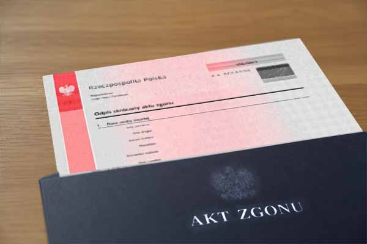
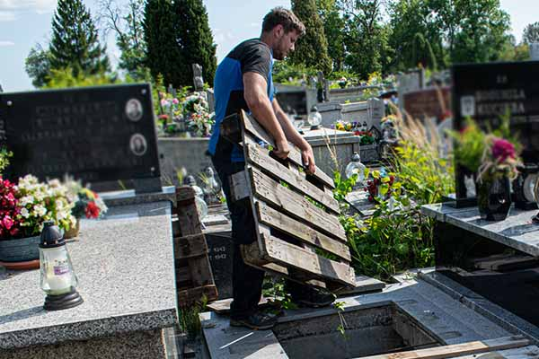

**W chwilach, gdy żegnamy bliską osobę, naszym głównym pragnieniem jest spokój i możliwość przeżycia żałoby. Niestety, rzeczywistość wymaga od nas również dopełnienia szeregu urzędowych i cmentarnych formalności. Podobnie jest później, gdy decydujemy się na upamiętnienie zmarłego i chcemy postawić lub wymienić pomnik. Jak sprawnie przebrnąć przez urzędowe procedury? Podpowiadamy.**

<figcaption>Przystąpienie do pochówku wymaga uzyskania oficlajnego Aktu zgonu.</figcaption>

## Pochówek. Jakie dokumenty musisz dostarczyć na cmentarz?

Zanim w ogóle udamy się do zarządu cmentarza lub kancelarii parafialnej, jeśli mówimy o cmentarzu wyznaniowym, musimy przejść przez pierwszy, najważniejszy etap, czyli **uzyskanie Aktu zgonu**. Aby go otrzymać, z dokumentem od lekarza, tzw. kartą zgonu, oraz dowodem osobistym zmarłego musimy udać się do **Urzędu Stanu Cywilneg**o (USC) właściwego dla miejsca zgonu bliskiej nam osoby.

Polskie prawo wymaga zgłoszenia tego faktu **zazwyczaj w ciągu 3 dni lub w ciągu 24 godzin w przypadku chorób zakaźnych**. Po zarejestrowaniu zgonu, USC wydaje darmowe odpisy skrócone aktu zgonu. Mając te dokumenty w ręku, możemy przystąpić do organizacji samego pochówku. Biuro administracji cmentarza lub u zarządcy parafialnego będą wymagać następujących dokumentów.

**1\. Karta zgonu (część przeznaczona dla administracji cmentarza)**

To podstawowy dokument uprawniający do pochowania ciała. Lekarz (np. z pogotowia lub szpitala) wystawiający kartę zgonu dzieli ją na dwie części: **jedna zostaje w USC, a drugą przekazujemy zarządcy cmentarza**. Administracja musi ją otrzymać, ponieważ dokument ten potwierdza, że zgon nastąpił z przyczyn naturalnych lub po wypadku (po zgodzie prokuratora na pochówek) i określa, czy nie ma przeciwskazań sanitarnych, np. w przypadku niektórych chorób zakaźnych obowiązują inne procedury pogrzebowe.

**2\. Odpis skrócony aktu zgonu (do wglądu lub kopia)**

Administracja cmentarza zazwyczaj prosi również **o okazanie odpisu aktu zgonu z USC**. Warto wiedzieć, że urzędy wydają standardowo kilka darmowych odpisów, a zazwyczaj jeden z nich i tak musimy przeznaczyć do wniosku o wypłatę zasiłku pogrzebowego z ZUS. Na cmentarzu najczęściej wystarczy okazać oryginał do wglądu, a administracja zostawia sobie w teczce jego kopię.

**3\. Dowód osobisty osoby organizującej pogrzeb**

Administracja musi dokładnie zweryfikować tożsamość osoby, która podejmuje decyzje i podpisuje dokumentację cmentarną. Dlaczego to takie ważne? **Ponieważ to ta osoba staje się dysponentem nowo powstałego grobu** lub głównym decydentem w sprawie bieżącego pochówku. Polskie prawo ściśle określa **tzw. prawo do pochowania zwłok** - w pierwszej kolejności przysługuje ono współmałżonkowi, następnie zstępnym (dzieciom, wnukom), wstępnym (rodzicom) i dalszym krewnym.

**4\. Dokument potwierdzający prawo do grobu (przy tzw. dochowaniu):**

Jeśli zmarły nie będzie chowany w nowym miejscu, lecz w istniejącym już grobie rodzinnym, musimy udowodnić, że mamy prawo z tego miejsca skorzystać. Wymaga to okazania **opłaconej koncesji (pokwitowania/faktury)** z kasy cmentarza. Standardowa opłata za miejsce (tzw. pokładne) uiszczana jest na 20 lat. Jeśli ten termin minął, przed kolejnym pochówkiem konieczne będzie uregulowanie zaległości i przedłużenie ważności grobu na kolejne dwie dekady.

**Co, jeśli zgubiłeś pokwitowanie sprzed lat?** Bez paniki - zarządy cmentarzy prowadzą księgi cmentarne i systemy informatyczne. Zazwyczaj wystarczy podać dokładne dane osób tam pochowanych oraz numer kwatery, by administracja odnalazła wpis w rejestrze.

**5\. Pisemna zgoda pozostałych dysponentów grobu (w przypadku grobów istniejących)**

To punkt, który nierzadko rodzi najwięcej problemów. Prawo do grobu nie jest własnością w sensie czysto cywilnoprawnym, **ale dobrem osobistym o charakterze majątkowym, które podlega dziedziczeniu**. Jeżeli dysponentów grobu, czyli osób, które opłaciły grób lub odziedziczyły do niego prawo po zmarłych założycielach, jest kilku, administracja może zażądać ich pisemnej zgody na dochowanie kolejnej osoby. Chroni to zarządcę cmentarza przed ewentualnymi konfliktami rodzinnymi o to, kto ma prawo spocząć w danym miejscu.

<figcaption>Zakłady pogrzebowe zajmą się organizacją dokumentów dzięki pełnomocnictwu.</figcaption>

**Ważna uwaga praktyczna: Skorzystaj z pełnomocnictwa**

Perspektywa wizyt w urzędach, ZUS-ie, u zarządcy cmentarza i u proboszcza w ciągu zaledwie kilku dni jest przytłaczająca. W większości przypadków możesz udzielić **pisemnego pełnomocnictwa wybranemu zakładowi pogrzebowemu**. Wystarczy, że przekażesz im kartę zgonu od lekarza, dowód osobisty zmarłego oraz akt małżeństwa/urodzenia (jeśli to potrzebne), a pracownicy zakładu zajmą się formalnościami w Urzędzie Stanu Cywilnego i załatwią przydział miejsca lub zgłoszenie dochowania u zarządcy cmentarza. To standardowa usługa, która pozwala rodzinie skupić się na przeżywaniu żałoby i przygotowaniach do pożegnania, zdejmując z barków biurokratyczny ciężar.

## Wystawienie nowego pomnika lub wymiana starego. Co jest potrzebne?

Po pożegnaniu bliskiej osoby nadchodzi czas na **wybór i montaż nagrobka**. Termin rozpoczęcia prac zależy od rodzaju pochówku. W przypadku nowego grobu zaleca się odczekać **od 6 do 12 miesięcy po pogrzebie, aby ziemia naturalnie osiadła**. A jeśli **zmarły ma spocząć w istniejącym już grobowcu**, montaż pomnika można przeprowadzić niemal od razu.

Należy jednak pamiętać o kluczowej zasadzie: **na cmentarzu nie możemy działać samowolnie**, ponieważ jest to przestrzeń zarządzana ścisłymi regulaminami, a każda ingerencja w architekturę kwatery wymaga zgody administracji. Aby wybrany przez Ciebie zakład kamieniarski mógł rozpocząć prace, jako główny dysponent grobu musisz przygotować i dopełnić następujących formalności:

- **wniosek o postawienie lub wymianę/demontaż nagrobka:** zazwyczaj administracja cmentarza dysponuje własnymi, gotowymi formularzami. We wniosku podaje się dokładne dane zmarłego, numer kwatery, rzędu i miejsca, a także wskazuje się wykonawcę (dane firmy kamieniarskiej), który zrealizuje zlecenie;
- **projekt nagrobka z dokładnymi wymiarami (tzw. szkic):** administracja musi oficjalnie zaakceptować to, co ma stanąć na grobie. Cmentarze posiadają regulaminy określające maksymalne i minimalne dopuszczalne wymiary pomników (ich szerokość, długość oraz wysokość całkowitą). Ma to na celu zapobieganie samowolnemu zajmowaniu przestrzeni w wąskich alejkach, utrudnianiu przejścia innym osobom oraz naruszaniu granic sąsiednich kwater. Zazwyczaj taki profesjonalny szkic z naniesionymi wymiarami przygotowuje dla Ciebie zakład kamieniarski - wystarczy dołączyć go do wniosku.
- **potwierdzenie uiszczenia opłat cmentarnych (tzw. pokładne):** administracja z pewnością odrzuci wniosek o budowę pomnika, jeśli samo miejsce pod grób nie jest opłacone. W Polsce standardowa opłata za grób ziemny wnoszona jest na 20 lat (tzw. prawo do grobu). Jeśli ten termin właśnie mija lub już minął, przed wydaniem zgody na prace kamieniarskie konieczne będzie uregulowanie zaległości w kasie cmentarza;
- **dowód osobisty dysponenta grobu:** wszelkie dokumenty i zgody na ingerencję w grób może podpisać wyłącznie osoba, która ma do niego oficjalne prawo;
- **pisemna zgoda innych osób uprawnionych:** do zmiany formy, demontażu starego i postawienia nowego pomnika, zazwyczaj wymagana jest pisemna zgoda wszystkich współdysponentów.

Pamiętaj, że zgoda na postawienie pomnika to jedno, ale jeśli planujesz również **położenie kostki brukowej wokół grobu lub montaż ławeczki**, musisz to wyraźnie zaznaczyć we wniosku. Wiele cmentarzy wymaga na te elementy osobnej zgody, a w niektórych miejscach, np. w bardzo wąskich alejkach, kategorycznie się ich zabrania ze względów bezpieczeństwa.

Zanim kamieniarz wjedzie na teren cmentarza, często musi zgłosić się do administracji, okazać projekt, a niekiedy wpłacić **kaucję zwrotną** **lub wnieść opłatę za wjazd**. Ma to na celu zabezpieczenie cmentarza przed ewentualnymi zniszczeniami (np. uszkodzeniem sąsiednich pomników podczas montażu) oraz gwarantuje posprzątanie terenu po zakończeniu prac.

<figcaption>Kamieniarstwo Wiśniewski zajmie się pomnikiem również od strony formalnej.</figcaption>

## Kto załatwia formalności z administracją cmentarza - dysponent grobu czy kamieniarz?

W firmie **Kamieniarstwo Wiśniewski** oferujemy kompleksową obsługę, w ramach której przejmujemy obowiązek dopełnienia niezbędnych procedur i reprezentujemy Cię w kontaktach z zarządem cmentarza.

Gdy podpiszesz z nami umowę i udzielisz nam stosownego upoważnienia, nasz przedstawiciel samodzielnie uda się do biura administracji cmentarza. Co dokładnie załatwimy w Twoim imieniu?

- **Złożenie dokumentów:** przedłożymy w biurze Twój wniosek o montaż nagrobka.
- **Akceptacja projektu:** przedstawimy zarządcy potwierdzenie uiszczenia opłat cmentarnych i dokładny projekt pomnika wraz z wymiarami do oficjalnej akceptacji.
- **Kwestie techniczne i opłaty:** zajmiemy się opłaceniem tzw. wjazdówki (opłaty za wjazd naszego sprzętu na teren cmentarza) oraz wpłacimy wymaganą przez cmentarz kaucję. Stanowi ona dla administracji gwarancję, że po zakończeniu naszych prac teren wokół zostanie posprzątany, a sąsiednie groby są całkowicie bezpieczne.

Zlecając **Kamieniarstwu Wiśniewski** budowę pomnika, nie musisz martwić się studiowaniem cmentarnych regulaminów. Zyskujesz spokój i pewność, że cała procedura przebiegnie sprawnie, od A do Z, a nowy nagrobek Twoich bliskich powstanie bez niepotrzebnego stresu.