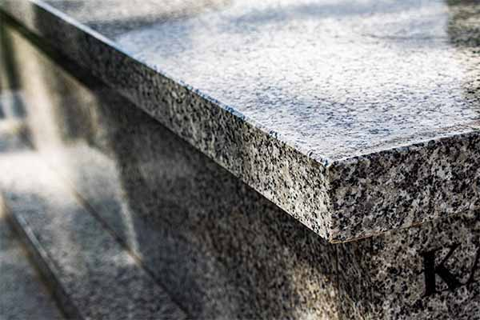
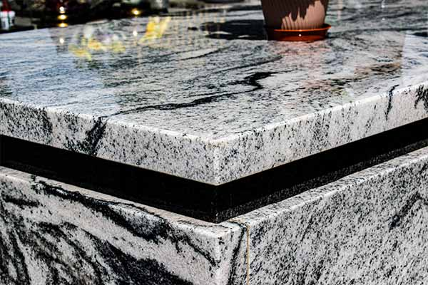

**Wybór nagrobka dla bliskiej osoby to trudny, często bardzo emocjonalny moment. Oprócz** **kwestii estetycznych i projektu samej bryły, stajemy przed dylematem: jaki kamień jest najlepszy na pomnik? Chcemy przecież, aby miejsce spoczynku prezentowało się godnie i nienagannie nie tylko w dniu montażu, ale przez długie dziesięciolecia. Choć rynek oferuje wiele możliwości, w polskim klimacie tak naprawdę tylko jedna skała gwarantuje spokój na pokolenia.**

## Jaki kamień na pomnik jest najtrwalszy w polskim klimacie?

Zdecydowanie najlepszym, najtrwalszym i najczęściej wybieranym kamieniem na pomnik w polskim klimacie jest **granit.** To głębinowa skała magmowa, która zawdzięcza swoją ekstremalną twardość specyficznym warunkom geologicznym**.**

Powstaje w wyniku **krystalizacji płynnej magmy na głębokości kilkunastu kilometrów pod powierzchnią Ziemi**. Bardzo powolne stygnięcie w warunkach gigantycznego ciśnienia sprawia, że jego struktura jest bardzo zbita i niemal całkowicie pozbawiona mikroszczelin. To właśnie z tego powodu pomniki z granitu są tak odporne na mrozy - kamień ten po prostu nie chłonie wody, więc nie rozsadza go lód.

Za niezwykłe właściwości fizyczne i wizualne nagrobka odpowiadają trzy główne minerały budujące tę skałę:

- **kwarc:** stanowi nawet do 60 procent składu granitu i gwarantuje mu ekstremalną odporność na uszkodzenia mechaniczne. Ma 7 stopień w 10-stopniowej skali twardości Mohsa, więc polerowana płyta nie rysuje się nawet podczas przesuwania ciężkich zniczy czy wazonów;
- **skaleń**: to od proporcji jego domieszek zależy, czy wydobyty blok przybierze barwę **głębokiej czerni** (jak luksusowy Szwed), **intensywnej czerwieni** (Vanga) czy też **jasnej**, **nakrapianej szarości** (polski Strzegom);
- **mika, zwana również łyszczykiem**: ten minerał odpowiada za charakterystyczny, lustrzany błysk i metaliczne refleksy, które możemy podziwiać po mechanicznym wypolerowaniu nagrobka.

Ze względu na to, że proces łączenia się tych minerałów w płynnej magmie jest całkowicie naturalny i trwał miliony lat, **na świecie nie istnieją dwie identyczne płyty granitowe**. Wybierając ten kamień na pomnik, otrzymujesz materiał o unikalnym, niepowtarzalnym układzie ziaren i gwarancję, że przetrwa on w niezmienionym stanie przez wiele pokoleń.

W przeciwieństwie do miękkich skał**, granit jest chemicznie obojętny**, więc nie wchodzi w reakcje z otoczeniem, zachowując swój głęboki kolor i lustrzany blask przez dziesięciolecia bez potrzeby kłopotliwej konserwacji.

<figcaption>Granit strzegomski, najpopularniejszy granit w Polsce.</figcaption>

## Jak powstaje pomnik?

Wydobycie tak twardego materiału jakim jest granit uległo z biegiem lat dużej metamorfozie. **Dawniej skały często rozsadzano materiałami wybuchowymi, a to niestety niosło ryzyko powstawania wewnątrz bloków ukrytych mikropęknięć**. Dziś w profesjonalnych kamieniołomach na całym świecie - od Szwecji, przez Indie, aż po polski Strzegom - stosuje się wyłącznie **piły z liną diamentową**. Te narzędzia z jubilerską precyzją odcinają od górotworu wielotonowe bloki litej skały. Następnie gigantyczne sześciany tnie się na wielkie, kilkucentymetrowe plastry, nazywane w branży kamieniarskiej **slabami**.

Dopiero w postaci takich surowych, całkowicie matowych płyt granit z całego świata przyjeżdża do naszego zakładu kamieniarskiego w Dąbrowie Górniczej. To tutaj nadajemy mu ostateczną formę. **Docinamy surowy materiał pod dokładny wymiar, frezujemy jego krawędzie i poddajemy wielogodzinnemu, mechanicznemu polerowaniu**. Na tym etapie zamykamy pory kamienia i wydobywamy z surowej skały jej naturalny, głęboki kolor oraz lustrzany blask.

## Jaki granit na pomnik jest najlepszy?

Klienci naszej pracowni często pytają, który kamień będzie obiektywnie najlepszym wyborem. Z technologicznego punktu widzenia, **każdy naturalny, prawidłowo obrobiony granit wykazuje ogromną żywotność**. Przez lata praktyki kamieniarskiej i setki montaży przeprowadzonych na śląskich cmentarzach, wyselekcjonowaliśmy jednak gatunki, które cechują się najlepszymi parametrami w polskim klimacie. Poniżej przedstawiamy zestawienie sprawdzonych granitów, z podziałem na różne półki cenowe.

**Rozwiązania ekonomiczne (wysoka jakość w przystępnej cenie):**

Wybór ekonomicznego granitu to po prostu mądra oszczędność. Zyskujesz trwałość na lata, a jedynie omijasz koszty drogiego transportu morskiego czy trudności w wydobyciu rzadkich bloków. To solidne materiały w rozsądnej cenie:

- **Strzegom (Polska)**: rodzimy granit o klasycznej, średnioziarnistej strukturze typu "pieprz i sól" (mieszanka bieli, szarości i czerni). Pod względem twardości i mrozoodporności dorównuje droższym kamieniom importowanym. Jego gęsto nakrapiana faktura maskuje zaschnięte krople deszczu, cmentarny kurz i drobne osady. To jeden z najbardziej bezobsługowych materiałów w naszej ofercie;
- **Brąz Królewski i jasne granity indyjskie**: materiały o bogatej, wielobarwnej strukturze, w której dominują ciepłe odcienie beżu, miedzi i głębokiego brązu, gęsto przeplecione ciemniejszymi kryształami. Niejednorodna tekstura doskonale maskuje żółty pyłek i opadające z drzew soki. To kamienie stanowią dobre, kontrastowe tło dla liter malowanych na złoto.

**Rozwiązania optymalne (najczęściej wybierane):**

- **Impala (RPA)**: znana w branży również jako Nero Impala. To szlachetny, ciemnografitowy (antracytowy) granit o niezwykle drobnym, jednolitym uziarnieniu, który w świetle słonecznym delikatnie mieni się srebrzystymi refleksami. To nasz bestseller, ponieważ stanowi idealny kompromis: zapewnia doskonały kontrast dla jasnych (piaskowanych) liter, a dzięki obecności szarych mikrokryształów kurz i smugi są na nim o wiele mniej widoczne niż na czystej czerni;
- **Viscont White (Indie):** to obecnie jeden z najgorętszych trendów w kamieniarstwie i materiał, po który nasi klienci sięgają niezwykle często. Wyróżnia się jasnym, biało-szarym tłem, przez które przepływają faliste, ciemniejsze smugi w odcieniach grafitu i czerni. Jego struktura do złudzenia przypomina ekskluzywny marmur, zachowując jednak pełną twardość i mrozoodporność granitu. Ze względu na dynamiczne użylenie, nie ma dwóch identycznych płyt, co gwarantuje niepowtarzalność każdego nagrobka, a jasna, wzorzysta powierzchnia znakomicie maskuje pył, kurz oraz zacieki po deszczu.

<figcaption>Granit Viscont White połączony z Ciemną Impalą to wyjątkowo elegancki duet.</figcaption>

**Granity Premium (najwyższa estetyka i unikalność):**

Jeśli projekt pomnika zakłada użycie czystej, jednolitej czerni lub kamienia o najwyższej możliwej twardości, **sięgamy po granity ze Szwecji**. To materiały droższe, ale pod względem parametrów i głębi koloru nie mają sobie równych:

- **Czarny Szwed (Szwecja)**: skała o ekstremalnej gęstości i niemal zerowej nasiąkliwości. Po wielogodzinnym polerowaniu maszynowym uzyskuje idealną, smolistą czerń o strukturze gładkiego lustra - bez widocznych z daleka ziaren. Jest to najlepsze tło dla liter pokrytych 24-karatowym złotem. Warto jednak pamiętać, że będzie wymagać częstszego przecierania, ponieważ na lustrzanej czerni widać każdą drobinę jasnego pyłu;
- **Vanga (Szwecja)**: granit o bardzo wyrazistej, gruboziarnistej strukturze, w której dominują duże kryształy w odcieniach ceglastej czerwieni i bordo, przemieszane z czarnym kwarcem. Jest to jedna z najtwardszych i najtrudniejszych w obróbce skał na świecie. Dla klienta oznacza to powierzchnię o potężnej odporności na zarysowania (np. od przesuwania ciężkich lampionów) oraz kolor, który nie wyblaknie nawet na nagrobkach wystawionych na całodniowe, ostre słońce.

Rodzaj granitu warto dopasować do bezpośredniego otoczenia grobu. Jeśli pomnik będzie znajdował się w silnie zalesionej części cmentarza, np. pod brzozami lub dębami, **najbardziej praktycznym wyborem będą granity jasne lub mocno nakrapiane**, które naturalnie maskują opadające liście i soki z drzew. Z kolei na przestrzeniach otwartych i nasłonecznionych doskonale sprawdzą się eleganckie, ciemne płyty.

Zdecydowanie odradzamy stosowanie najtańszych materiałów o niesprawdzonym pochodzeniu. Na rynku można spotkać kamienie, które w celu ukrycia naturalnych wad są fabrycznie powlekane żywicami lub chemicznie barwione. Niestety, w polskim klimacie takie płyty już po kilku sezonach ulegają trwałemu zmatowieniu i odbarwieniu, a ich renowacja jest niemożliwa.

<figcaption>Choć kosztowne, ciemne granity są najlepszym tłem dla złoconych dekoracji grawerowych.</figcaption>

## Skonsultuj swój projekt w naszej pracowni

W zakładzie Kamieniarstwo Wiśniewski w Dąbrowie Górniczej **pracujemy wyłącznie na certyfikowanych, w pełni naturalnych surowcach**. Rozumiemy, że wybór nagrobka to często trudny moment, a mnogość dostępnych materiałów może przytłaczać. Dlatego jesteśmy tu po to, by Ci pomóc.

Zapraszamy do kontaktu z naszą pracownią. Chętnie wysłuchamy Twoich oczekiwań, odpowiemy na wszelkie pytania techniczne i przygotujemy przejrzystą, niezobowiązującą wycenę. Stawiamy na rzetelną pracę i kamień, który sam obroni się swoją trwałością.